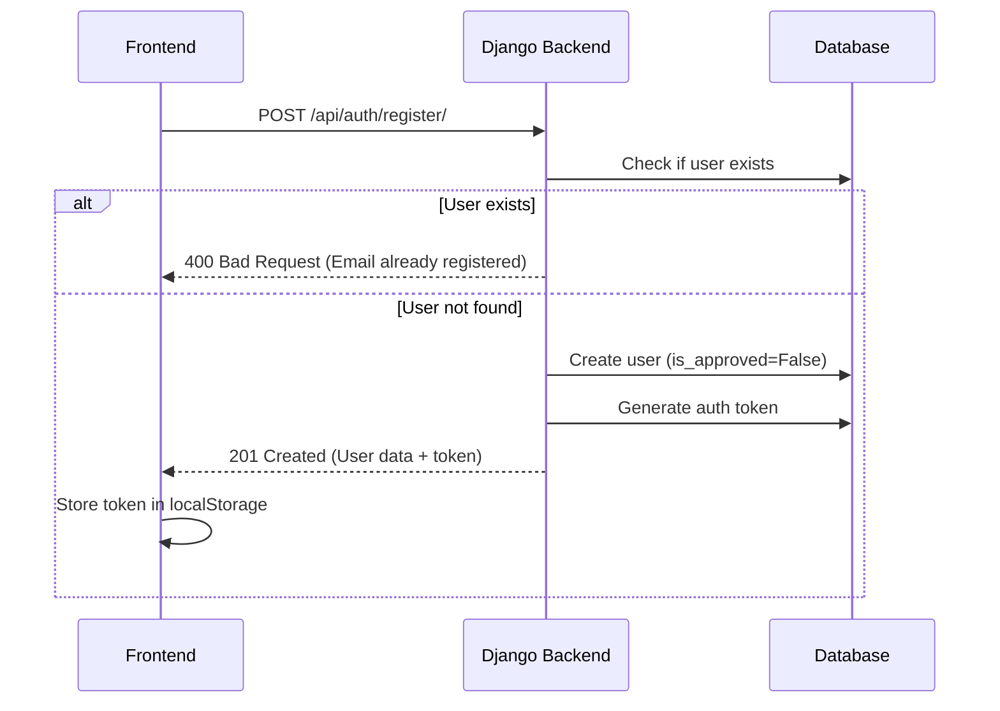
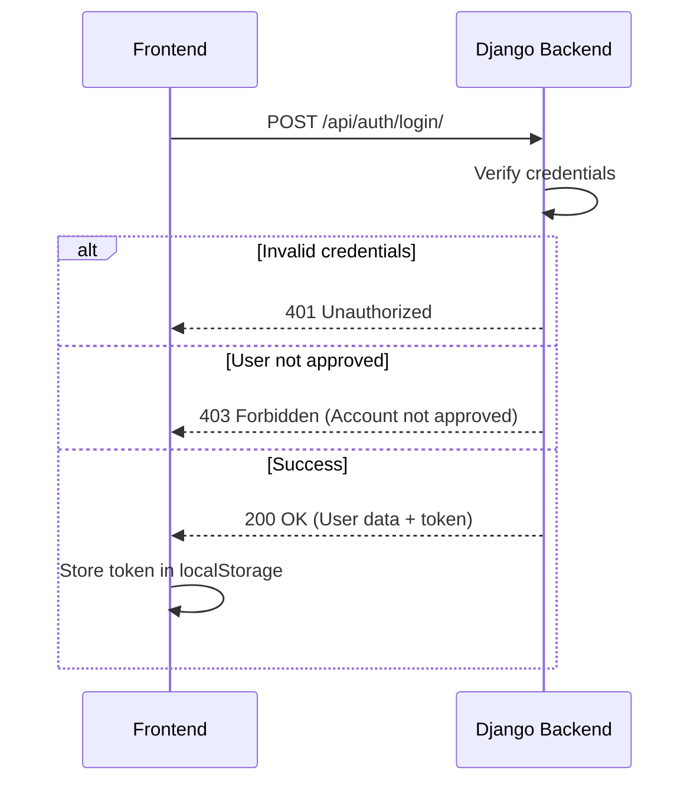
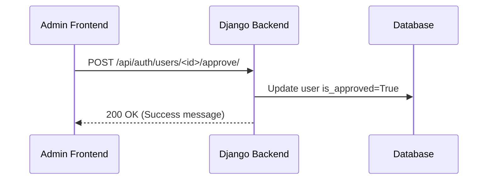
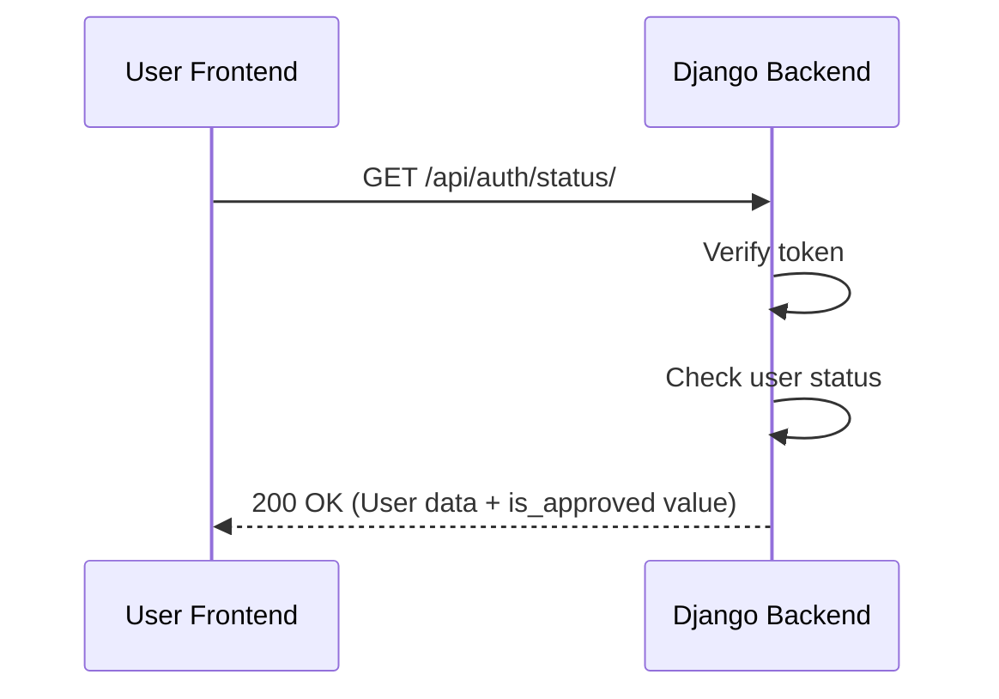

# Technical Implementation Plan

## Backend Structure

### 1. Django Project Configuration

```
backend/
├── manage.py
├── config/
│   ├── __init__.py
│   ├── settings.py          # Updated with DRF and custom user model
│   ├── urls.py             # Main URL configuration
│   ├── asgi.py
│   └── wsgi.py
└── authentication/
    ├── __init__.py
    ├── admin.py            # Admin configuration for custom user
    ├── apps.py             # App configuration
    ├── models.py           # Custom User model
    ├── serializers.py      # DRF serializers
    ├── views.py            # API views
    ├── urls.py             # Authentication API URLs
    └── permissions.py      # Custom permissions
```

### 2. Database Models

```python
# authentication/models.py
from django.contrib.auth.models import AbstractUser
from django.db import models

class CustomUser(AbstractUser):
    is_approved = models.BooleanField(default=False)
    welcome_bonus = models.DecimalField(
        max_digits=10, 
        decimal_places=2, 
        default=10.00
    )
    
    def __str__(self):
        return self.email
```

### 3. API Views Structure

```python
# authentication/views.py
from rest_framework import viewsets, status
from rest_framework.decorators import action
from rest_framework.response import Response
from rest_framework.permissions import IsAuthenticated, IsAdminUser
from rest_framework.authtoken.models import Token
from django.contrib.auth import authenticate

from .models import CustomUser
from .serializers import UserSerializer, LoginSerializer
from .permissions import IsAdminOrSelf

class UserViewSet(viewsets.ModelViewSet):
    queryset = CustomUser.objects.all()
    serializer_class = UserSerializer
    permission_classes = [IsAuthenticated, IsAdminOrSelf]
    
    @action(detail=False, methods=['post'])
    def register(self, request):
        # Registration logic
        
    @action(detail=False, methods=['post'])
    def login(self, request):
        # Login logic
        
    @action(detail=False, methods=['post'])
    def logout(self, request):
        # Logout logic
        
    @action(detail=False, methods=['get'])
    def status(self, request):
        # Get user status
        
    @action(detail=True, methods=['post'], permission_classes=[IsAdminUser])
    def approve(self, request, pk=None):
        # Approve user
```

### 4. API Endpoints Reference

| Endpoint | Method | Description | Headers |
|----------|--------|-------------|---------|
| `/api/auth/register/` | POST | Register new user | - |
| `/api/auth/login/` | POST | User login | - |
| `/api/auth/logout/` | POST | User logout | Token |
| `/api/auth/status/` | GET | Get user status | Token |
| `/api/auth/users/<id>/approve/` | POST | Approve user | Token (admin) |

## Frontend API Integration

### 1. API Service Layer

```typescript
// utils/api.ts
import axios from 'axios';

const API_BASE_URL = 'http://localhost:8000/api';

const api = axios.create({
  baseURL: API_BASE_URL,
});

api.interceptors.request.use((config) => {
  const token = localStorage.getItem('auth_token');
  if (token) {
    config.headers.Authorization = `Token ${token}`;
  }
  return config;
});

// Authentication API methods
export const authAPI = {
  register: (data: { name: string; email: string; password: string }) =>
    api.post('/auth/register/', data),
  
  login: (data: { email: string; password: string }) =>
    api.post('/auth/login/', data),
  
  logout: () =>
    api.post('/auth/logout/'),
  
  getStatus: () =>
    api.get('/auth/status/'),
  
  approveUser: (userId: string) =>
    api.post(`/auth/users/${userId}/approve/`),
};

export default api;
```

### 2. Authentication Context Updates

```typescript
// components/AuthContext.tsx
import { createContext, useContext, useState, useEffect, ReactNode } from 'react';
import { authAPI } from '../utils/api';

interface User {
  id: string;
  email: string;
  name: string;
  is_approved: boolean;
  welcomeBonus: number;
}

interface AuthContextType {
  user: User | null;
  isAuthenticated: boolean;
  isLoading: boolean;
  login: (email: string, password: string) => Promise<boolean>;
  register: (name: string, email: string, password: string) => Promise<boolean>;
  logout: () => void;
  isVerificationScreenSeen: boolean;
  markVerificationScreenSeen: () => void;
  checkApprovalStatus: () => Promise<boolean>;
}

// ...
```

## Authentication Workflow

### User Registration Flow



### User Login Flow



### Admin Approval Flow



### Verification Status Check



## State Management

### Frontend Authentication State

```typescript
// Authentication state structure
{
  user: {
    id: string,
    email: string,
    name: string,
    is_approved: boolean,
    welcomeBonus: number
  },
  isAuthenticated: boolean,
  isLoading: boolean,
  token: string,
  isVerificationScreenSeen: boolean
}
```

### Backend User States

| State | Description | Access |
|-------|-------------|--------|
| Registered | User created but not approved | No login access |
| Approved | User approved by admin | Full access |
| Active | User logged in | Full access |

## Security Measures

### Backend Security

- Token-based authentication using DRF TokenAuthentication
- Password hashing using Django's built-in bcrypt
- Custom permissions for admin-only endpoints
- CORS configuration to restrict API access
- Input validation using DRF serializers

### Frontend Security

- Token storage in localStorage
- Token validation on every request
- Secure API calls with HTTPS
- Input sanitization in forms
- Error handling for authentication failures

## Error Handling

### Common Error Scenarios

| Error | Status Code | Message | Handling |
|-------|-------------|---------|----------|
| Invalid credentials | 401 | Invalid email or password | Show error message in login form |
| Account not approved | 403 | Your account is not approved yet | Redirect to verification page |
| Token expired | 401 | Authentication token expired | Show login screen |
| Email already registered | 400 | Email already registered | Show error in registration form |
| Server error | 500 | Something went wrong | Display generic error message |

## Performance Considerations

### Backend Optimization

- Use database indexes for email field
- Cache frequently accessed user data
- Implement token refresh mechanism
- Optimize query performance

### Frontend Optimization

- Implement request caching
- Use loading states to improve UX
- Optimize API calls with debouncing
- Implement offline support

## Testing Strategy

### Backend Tests

```python
# tests/test_auth.py
from rest_framework.test import APITestCase
from rest_framework import status
from django.contrib.auth.models import User

class AuthTests(APITestCase):
    def test_register_user(self):
        # Test user registration
        
    def test_login_user(self):
        # Test user login
        
    def test_admin_approval(self):
        # Test admin approval
        
    def test_unapproved_user_access(self):
        # Test unapproved user can't login
```

### Frontend Tests

```typescript
// tests/AuthContext.test.tsx
import { renderHook, act } from '@testing-library/react';
import { AuthProvider, useAuth } from '../components/AuthContext';

describe('AuthContext', () => {
  test('should register user', async () => {
    // Test registration
    
  test('should login user', async () => {
    // Test login
    
  test('should logout user', () => {
    // Test logout
  });
});
```
